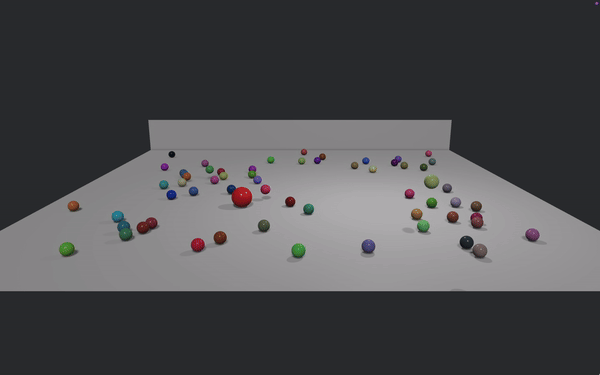

# Rust Physics Sim

An interactive 3D physics simulation implemented in Rust using the Bevy Engine

Example scene:


### Features

- Interactive ball simulation.
- Simple 3D physics.

## Dependencies

To build the app, you need the following dependencies:

- Rust compilier (cargo)

### Installing dependencies on MacOS

1. Ensure Rust is installed
```
curl --proto '=https' --tlsv1.2 -sSf https://sh.rustup.rs | sh
```
2. (May be required) Install Xcode command-line tools
```
xcode-select --install
```

## Building Instructions

### Building for Linux and MacOS

Follow these steps to build the app:

1. Clone the repository:
```
git clone https://github.com/Hal609/BevyPhysicsSim.git
cd BevyPhysicsSim
```
2. Build the project
   1. Option 1: Using the shell script.
    ```
    ./app_build_mac.sh
    ```

    2. Option 2: Manual build (See  for more details).
    Create the folder structure
    ```
    mkdir -p "ThreeDSim.app/Contents/MacOS"
    mkdir -p "ThreeDSim.app/Contents/Resources"
    ```
    Copy Info.plist
    ```
    cp Info.plist "ThreeDSim.app/Contents/Info.plist"
    ```
    Copy the icon
    ```
    cp AppIcon.icns "ThreeDSim.app/Contents/Resources/AppIcon.icns"
    ```
    Compile the executables for each architecture (Optional if universal app is not required) 
    ```
    cargo build --release --target x86_64-apple-darwin # build for Intel
    cargo build --release --target aarch64-apple-darwin # build for Apple Silicon
    ```
    Combine the executables into a single file and put it in the bundle (Alternatively, copy the binary for the desired architecture to .app/Contents/MacOS)
   ```
    lipo "target/x86_64-apple-darwin/release/${RUST_CRATE_NAME}" \
         "target/aarch64-apple-darwin/release/${RUST_CRATE_NAME}" \
         -create -output "${APP_NAME}.app/Contents/MacOS/ThreeDSim"
    ```

## Usage

After building the project, you can run the project from the app. Use *W, A, S, D* to control the larger ball and *space* to jump.

## Contributing

Contributions to are welcome! If you have suggestions for improvements or encounter any issues, please feel free to open an issue or submit a PR.

## License

This project is licensed under the GNU General Public License v3.0 - see the [LICENSE](LICENSE.txt) file for details.
